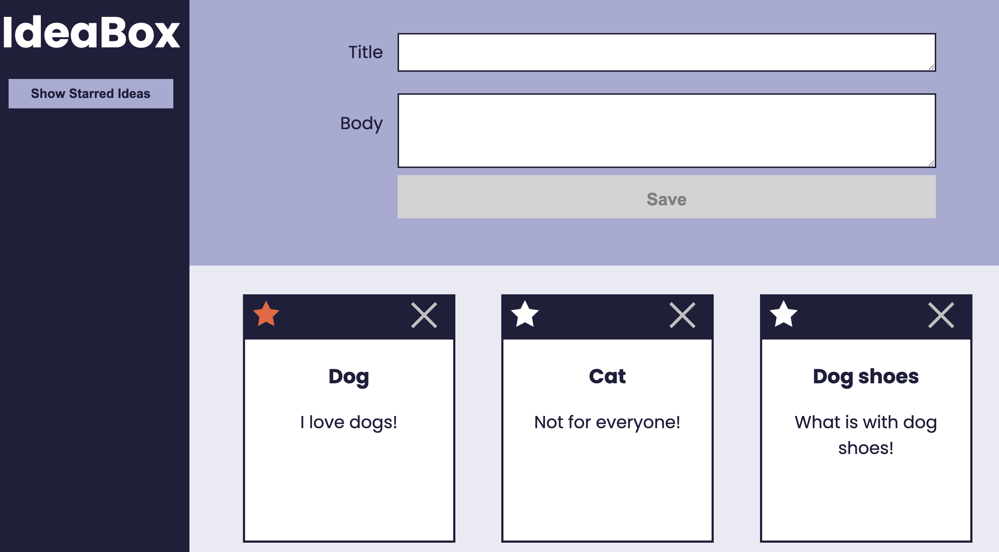

# IdeaBox

### Abstract:
This project allows a user to keep track of ideas.  The interface allows the user to display ideas, create favorite ideas and display those seperately, and delete ideas.  

---
### Installation Instructions:
The user can visit this web site: 
https://ericahagle.github.io/ideabox/

---
### Preview of App:

---
### Context:

---
### Contributors:
#### Dev Team:
- [Erica Hagle](https://github.com/ericahagle)
- [Ben Rosner](https://github.com/ben-rosner-williamsburg)
- [Chris Butler](https://github.com/butlertree)
#### Project Manager:
- [Travis Rollins](https://github.com/kalikoze)
---
### Learning Goals:
- Gain an understanding of how to write clean HTML and CSS to match a provided comp
- Understand how a developer might separate the data model from the DOM model
- Incorporate & iterate over arrays in order to filter what is being displayed
- Craft code with clean style, using small functions that show trends toward DRYness, SRP, and purity
---
### Wins + Challenges:

---
